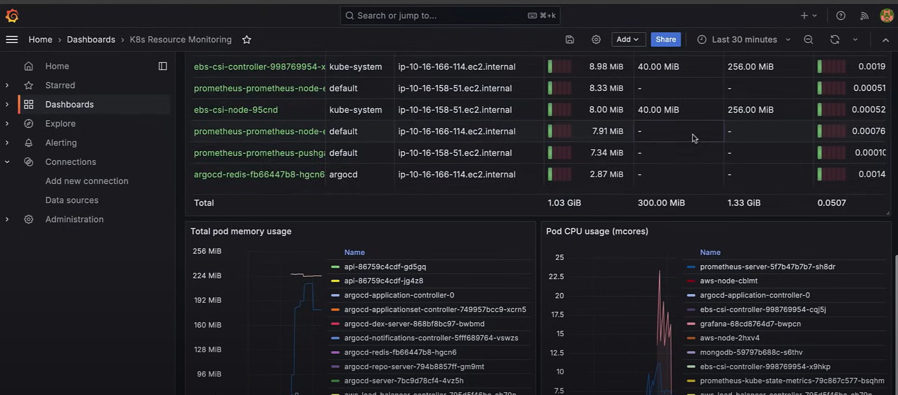
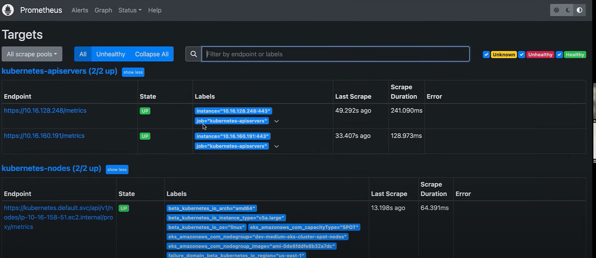

# Monitoring Setup with Prometheus and Grafana (Full Guide)

This guide explains how to install, expose, and integrate Prometheus and Grafana in a Kubernetes cluster for full observability.

---

## 📥 Step 1: Add Helm Repositories

```bash
helm repo add stable https://charts.helm.sh/stable
helm repo add prometheus-community https://prometheus-community.github.io/helm-charts
helm repo add grafana https://grafana.github.io/helm-charts
helm repo update
```

---

## 🚀 Step 2: Install Prometheus

```bash
helm install prometheus prometheus-community/prometheus
```

Verify the resources:

```bash
kubectl get all
kubectl get pvc
```

---

## 🌐 Step 3: Expose Prometheus

```bash
kubectl edit svc prometheus-server
```

Change:

```yaml
type: ClusterIP
```

To:

```yaml
type: LoadBalancer
```

Then check the external IP:

```bash
kubectl get svc prometheus-server
```

Access Prometheus UI using the external URL on port `80`.

---

## 📊 Step 4: Install and Expose Grafana

```bash
helm install grafana grafana/grafana
kubectl edit svc grafana
```

Change the service type from `ClusterIP` to `LoadBalancer` and ensure port `3000` is set.

Check Grafana external URL:

```bash
kubectl get svc grafana
```

---

## 🔐 Step 5: Get Grafana Admin Credentials

### Option A: Edit Secret

```bash
kubectl edit secrets grafana
```

Find base64-encoded `admin-password` and `admin-user`, then decode manually.

### Option B: Decode from CLI

```bash
kubectl get secret --namespace default grafana -o jsonpath="{.data.admin-password}" | base64 --decode ; echo
```

---

## 🔗 Step 6: Connect Prometheus as a Data Source in Grafana

1. Open the Grafana external URL.
2. Login using credentials from Step 5.
3. Go to **Connections → Data Sources → Add new**.
4. Select **Prometheus**.
5. Set the **Prometheus URL** as the external load balancer URL for Prometheus (e.g., `http://a1194...elb.amazonaws.com`).
6. Save & Test.

---

## 📈 Step 7: Import a Kubernetes Dashboard

1. Go to **Dashboards → Import**.
2. Enter dashboard ID: `6417`.
3. Click **Load**.
4. Select Prometheus as the data source.
5. Click **Import**.

### 🖼️ Sample Grafana Dashboard



---

## ✅ Step 8: Validate Prometheus

- Access Prometheus via external URL
- Navigate to `Status → Targets`
- Confirm targets are UP and metrics are visible

### 🖼️ Sample Prometheus Targets



---

✅ You now have Prometheus collecting metrics and Grafana visualizing them using an imported dashboard. You can extend this setup with alert rules, custom panels, and long-term storage.
